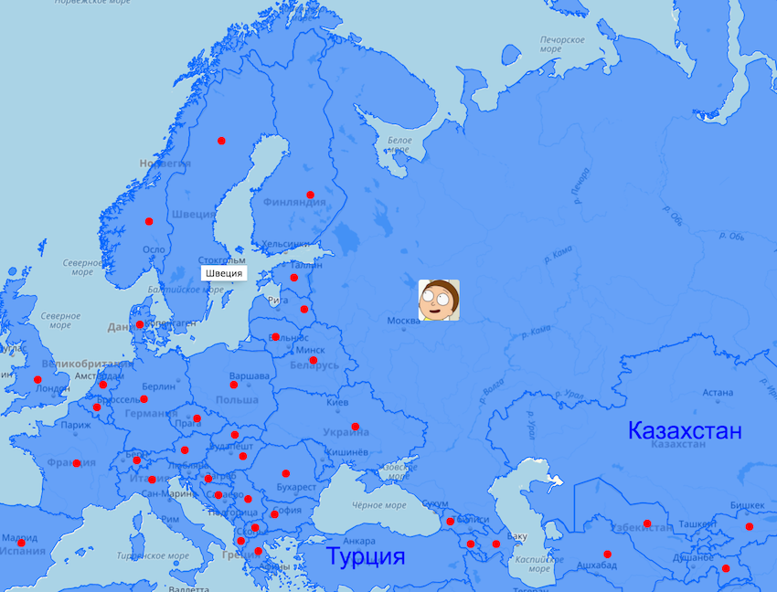

Подписи полигонов
===================


Данный модуль позволяет создавать различные подписи для полигонов.
Он работает на базе [JS API Яндекс.Карт](https://tech.yandex.ru/maps/doc/jsapi/2.1/quick-start/tasks/quick-start-docpage/)

Предоставляется возможность работать с двумя сущностями API: 
* [GeoObjectCollection](https://tech.yandex.ru/maps/doc/jsapi/2.1/ref/reference/GeoObjectCollection-docpage/)
* [ObjectManager](https://tech.yandex.ru/maps/doc/jsapi/2.1/ref/reference/ObjectManager-docpage/)

----------

Запуск
-------------
Скачиваем файл **util.createPolylabel.min.js**, который находится по пути **/build/util.createPolylabel.min.js**

Далее запускаем модуль:
```js
/**
 * @param {Map} map - экземпляр карты
 * @param {GeoObjectCollection | ObjectManager} component - 
 * экземпляр коллекции или менеджера объектов, в котором находятся полигоны для подписи
 */
const polyLabeler = new ymaps.util.createPolylabel(map, component);

```

Документация
-------------
